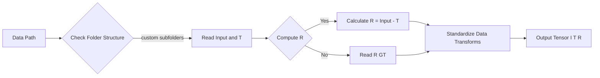

# 📂 DExNet 資料載入架構總結

本文件總結了在 DExNet 專案中針對多來源資料集所設計的載入架構。此架構成功解決了資料夾結構不一致、缺少反射層 (Reflection Layer) GT 的問題，並針對 Windows 環境進行了效能優化。**請在實作後續模型（如 IBCLN, RAGNet 等）時參考此架構。**

## 1. 核心類別：[UnifiedDSRDataset](file:///d:/DL_term_project/Models/DExNet/data/sirs_dataset.py#230-378)

這是一個通用的 Dataset Wrapper，能夠適應不同的資料夾命名習慣，並具備動態計算反射層的能力。

- **程式碼參考**：[Models/DExNet/data/sirs_dataset.py](file:///d:/DL_term_project/Models/DExNet/data/sirs_dataset.py) (Class [UnifiedDSRDataset](file:///d:/DL_term_project/Models/DExNet/data/sirs_dataset.py#230-378))
- **主要功能**：
    - **自定義路徑**：透過 `subfolders` 參數指定 Input, Transmission, Reflection 的資料夾名稱。
    - **動態計算**：若資料集缺少反射層 GT，可設定 `compute_r=True`，程式會自動計算 `R = Input - Transmission` (並做 clamp 處理)。
    - **統一轉換**：確保 Input, T, R 三者在進行 Random Crop/Flip/Rotate 時使用相同的參數，保持空間對齊。

### 邏輯流程


## 2. 資料集配置表 (Dataset Configuration)

目前使用的四個訓練資料集配置如下 (參考 [train_sirs.py](file:///d:/DL_term_project/Models/DExNet/train_sirs.py))：

| Dataset ID | 資料集名稱 | Input Folder | T Folder | R Folder | compute_r | 說明 |
| :--- | :--- | :--- | :--- | :--- | :--- | :--- |
| **Set 1** | `13700` | [syn](file:///d:/DL_term_project/Models/DExNet/data/sirs_dataset.py#198-209) | `t` | `r` | `False` | 完整合成資料，含真實 R |
| **Set 2** | `Berkeley_Real` | `blended` | `transmission_layer` | `reflection_layer` (空) | **`True`** | 需計算 R |
| **Set 3** | `Nature` | `blended` | `transmission_layer` | `reflection_layer` (空) | **`True`** | 需計算 R |
| **Set 4** | `unaligned` | `blended` | `transmission_layer` | (無資料夾) | **`True`** | 需計算 R |

## 3. 混合策略 ([FusionDataset](file:///d:/DL_term_project/Models/DExNet/data/sirs_dataset.py#400-422))

為了平衡不同資料集的大小差異（Set 1 遠大於其他），使用了 [FusionDataset](file:///d:/DL_term_project/Models/DExNet/data/sirs_dataset.py#400-422) 進行加權採樣。

- **混合比例**：`[0.4, 0.2, 0.2, 0.2]`
    - Set 1 (Syn): 40%
    - Set 2 (Real): 20%
    - Set 3 (Nature): 20%
    - Set 4 (Unaligned): 20%
- **目的**：避免模型過度擬合合成資料，同時保留真實場景的特徵。

## 4. Windows 效能與程式碼優化

在 Windows 環境下訓練時，為了克服 DataLoader 的多進程 (Multiprocessing) 開銷與顯存瓶頸，實作了以下優化：

### A. DataLoader 優化 (重要)
在 [DataLoader](file:///d:/DL_term_project/Models/DExNet/data/sirs_dataset.py#166-175) 初始化時加入以下參數，以解決 CPU 餵資料太慢的問題：
```python
train_dataloader = DataLoader(
    dataset,
    batch_size=opt.batchSize,
    shuffle=True,
    num_workers=4,            # Windows 建議 4-8，視 CPU 核心數而定
    pin_memory=True,          # 加速 CPU 到 GPU 傳輸
    prefetch_factor=2,        # [新增] 強迫每個 worker 預取 2 個 batch
    persistent_workers=True   # [新增] 讓 worker 駐留記憶體，避免每個 epoch 重啟開銷
)
```

### B. 顯存優化 (VRAM)
針對 RTX 4070 (12GB) 顯存吃緊的情況：
1.  **AMP (Automatic Mixed Precision)**：使用 `torch.amp.autocast('cuda')` 與 `torch.amp.GradScaler('cuda')` 進行半精度訓練。
2.  **凍結 Loss Network**：若使用 VGG 計算 Perceptual Loss，務必設定 `requires_grad=False`。
3.  **強制清理**：在每個 Epoch 結束時呼叫 `torch.cuda.empty_cache()`。

## 5. 給後續模型的實作建議

當您開始實作下一個模型時，請遵循以下步驟：

1.  **移植程式碼**：將 [sirs_dataset.py](file:///d:/DL_term_project/Models/DExNet/data/sirs_dataset.py) 中的 [UnifiedDSRDataset](file:///d:/DL_term_project/Models/DExNet/data/sirs_dataset.py#230-378) 類別直接複製到新模型的資料處理模組中。
2.  **複製配置**：在訓練腳本 (如 `train.py`) 中，完全複製上述的資料集路徑配置與 [FusionDataset](file:///d:/DL_term_project/Models/DExNet/data/sirs_dataset.py#400-422) 比例。
3.  **套用優化**：務必在新模型的 [DataLoader](file:///d:/DL_term_project/Models/DExNet/data/sirs_dataset.py#166-175) 中加入 `prefetch_factor` 與 `persistent_workers` 參數。

---
*Created by Antigravity for DL Term Project*
