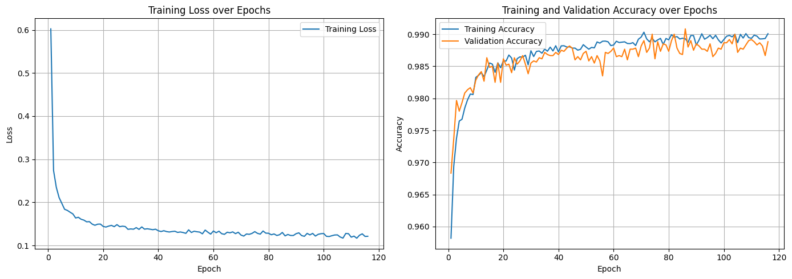
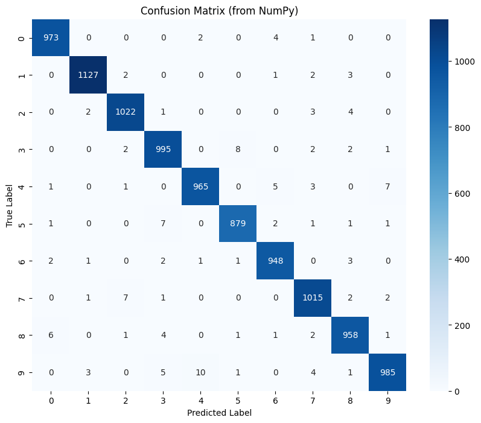

```python
# 最終版 NeuralNetwork Class (Adam Optimizer)

import numpy as np
import matplotlib.pyplot as plt
import seaborn as sns
import pandas as pd
import scipy.ndimage

def sigmoid(z):
    z = np.clip(z, -500, 500)
    return 1 / (1 + np.exp(-z))

def sigmoid_derivative(a):
    return a * (1 - a)
    
def relu(z):
    return np.maximum(0, z)

def relu_derivative(a):
    return (a > 0).astype(int)
    
def leaky_relu(z, alpha=0.01):
    return np.where(z > 0, z, z * alpha)

def leaky_relu_derivative(a, alpha=0.01):
    # 注意：這裡的 a 是 relu 的輸出
    dz = np.ones_like(a)
    dz[a <= 0] = alpha
    return dz

def softmax(z):
    exp_z = np.exp(z - np.max(z, axis=1, keepdims=True))
    return exp_z / np.sum(exp_z, axis=1, keepdims=True)

def cross_entropy_loss(y_pred, y_true):
    n_samples = y_true.shape[0]
    loss = -np.sum(y_true * np.log(y_pred + 1e-9)) / n_samples
    return loss
    

class NeuralNetwork:
    def __init__(self, input_size, hidden_size, output_size, 
                 hidden_activation='relu', l2_lambda=0.0, 
                 beta1=0.9, beta2=0.999, epsilon=1e-8,
                 dropout_rate=0.0,
                 initial_learning_rate=0.001, learning_rate_decay=0.0, seed=42):
        
        self.input_size, self.hidden_size, self.output_size = input_size, hidden_size, output_size
        self.hidden_activation_name = hidden_activation
        self.l2_lambda = l2_lambda

        # --- DROPOUT ---
        self.dropout_rate = dropout_rate # <--- 儲存 dropout_rate

        self.initial_learning_rate, self.learning_rate_decay = initial_learning_rate, learning_rate_decay
        self.current_learning_rate = initial_learning_rate
        
        # Adam 參數
        self.beta1, self.beta2, self.epsilon, self.t = beta1, beta2, epsilon, 0

        print("--- 初始化最終版神經網路 (Adam Optimizer) ---")
        print(f"網路架構: Input({input_size}) -> Hidden({hidden_size}) -> Output({output_size})")
        print(f"隱藏層啟用函數: {hidden_activation.upper()}")
        print(f"優化器: Adam (beta1={beta1}, beta2={beta2})")
        print(f"L2 正規化 Lambda: {l2_lambda}")
        print(f"初始學習率: {initial_learning_rate}, 衰減率: {learning_rate_decay}")

        # 初始化權重與偏差
        np.random.seed(seed)
        if hidden_activation == 'relu': # He 初始化
            self.W1 = np.random.randn(input_size, hidden_size) * np.sqrt(2. / input_size)
            self.W2 = np.random.randn(hidden_size, output_size) * np.sqrt(2. / hidden_size)
        else: # Xavier 初始化
            self.W1 = np.random.randn(input_size, hidden_size) * np.sqrt(1. / input_size)
            self.W2 = np.random.randn(hidden_size, output_size) * np.sqrt(1. / hidden_size)
        self.b1, self.b2 = np.zeros((1, hidden_size)), np.zeros((1, output_size))

        # 初始化 Adam 的動量
        self.m_W1, self.v_W1 = np.zeros_like(self.W1), np.zeros_like(self.W1)
        self.m_b1, self.v_b1 = np.zeros_like(self.b1), np.zeros_like(self.b1)
        self.m_W2, self.v_W2 = np.zeros_like(self.W2), np.zeros_like(self.W2)
        self.m_b2, self.v_b2 = np.zeros_like(self.b2), np.zeros_like(self.b2)

        # 選擇啟用函數
        if hidden_activation == 'relu':
            self._hidden_activation_fn = relu
            self._hidden_activation_deriv_fn = relu_derivative
        else:
            self._hidden_activation_fn = sigmoid
            self._hidden_activation_deriv_fn = sigmoid_derivative
            
    def forward(self, X_batch, training=True):
        self.Z1 = np.dot(X_batch, self.W1) + self.b1
        self.A1 = self._hidden_activation_fn(self.Z1)

        # --- DROPOUT ---
        # 只在訓練 (training=True) 且 dropout_rate > 0 時才啟用
        if training and self.dropout_rate > 0:
            # 1. 產生遮罩 (mask) D1，數值為 0 或 1
            #    (1 - dropout_rate) 是保留神經元的機率
            self.D1 = np.random.rand(*self.A1.shape) < (1 - self.dropout_rate)
            # 2. 應用遮罩
            self.A1 *= self.D1
            # 3. 進行縮放 (Inverted Dropout)，以維持輸出的期望值
            #    這樣在預測時就不需要做任何調整
            self.A1 /= (1 - self.dropout_rate)

        self.Z2 = np.dot(self.A1, self.W2) + self.b2
        self.A2 = softmax(self.Z2)
        return self.A2

    def backward_and_update(self, X_batch, y_batch):
        n_samples = X_batch.shape[0]
        self.t += 1 # Adam 時間步 +1
        
        # 計算原始梯度
        delta_Z2 = self.A2 - y_batch
        dW2 = np.dot(self.A1.T, delta_Z2) / n_samples
        db2 = np.sum(delta_Z2, axis=0, keepdims=True) / n_samples

        dA1 = np.dot(delta_Z2, self.W2.T)

        # --- DROPOUT ---
        # 如果啟用了 Dropout，將同樣的遮罩應用到反向傳播的梯度上
        if self.dropout_rate > 0:
            dA1 *= self.D1
            dA1 /= (1 - self.dropout_rate)

        delta_Z1 = dA1 * self._hidden_activation_deriv_fn(self.A1)
        dW1 = np.dot(X_batch.T, delta_Z1) / n_samples
        db1 = np.sum(delta_Z1, axis=0, keepdims=True) / n_samples
        
        # L2 正規化
        if self.l2_lambda > 0:
            dW2 += (self.l2_lambda / n_samples) * self.W2
            dW1 += (self.l2_lambda / n_samples) * self.W1
            
        # Adam 更新
        self.m_W1 = self.beta1 * self.m_W1 + (1 - self.beta1) * dW1
        self.m_b1 = self.beta1 * self.m_b1 + (1 - self.beta1) * db1
        self.m_W2 = self.beta1 * self.m_W2 + (1 - self.beta1) * dW2
        self.m_b2 = self.beta1 * self.m_b2 + (1 - self.beta1) * db2

        self.v_W1 = self.beta2 * self.v_W1 + (1 - self.beta2) * (dW1**2)
        self.v_b1 = self.beta2 * self.v_b1 + (1 - self.beta2) * (db1**2)
        self.v_W2 = self.beta2 * self.v_W2 + (1 - self.beta2) * (dW2**2)
        self.v_b2 = self.beta2 * self.v_b2 + (1 - self.beta2) * (db2**2)
        
        m_W1_corr = self.m_W1 / (1 - self.beta1**self.t)
        m_b1_corr = self.m_b1 / (1 - self.beta1**self.t)
        m_W2_corr = self.m_W2 / (1 - self.beta1**self.t)
        m_b2_corr = self.m_b2 / (1 - self.beta1**self.t)
        
        v_W1_corr = self.v_W1 / (1 - self.beta1**self.t)
        v_b1_corr = self.v_b1 / (1 - self.beta1**self.t)
        v_W2_corr = self.v_W2 / (1 - self.beta2**self.t)
        v_b2_corr = self.v_b2 / (1 - self.beta2**self.t)

        self.W1 -= self.current_learning_rate * m_W1_corr / (np.sqrt(v_W1_corr) + self.epsilon)
        self.b1 -= self.current_learning_rate * m_b1_corr / (np.sqrt(v_b1_corr) + self.epsilon)
        self.W2 -= self.current_learning_rate * m_W2_corr / (np.sqrt(v_W2_corr) + self.epsilon)
        self.b2 -= self.current_learning_rate * m_b2_corr / (np.sqrt(v_b2_corr) + self.epsilon)

    def train(self, X_train, y_train, X_val, y_val, epochs, batch_size=64, patience=10):
        print(f"\n--- 開始訓練 (Adam, Early Stopping, Data Augmentation, Dropout) ---")
        history = {'train_loss': [], 'train_acc': [], 'val_loss': [], 'val_acc': []}
        
        best_val_acc = -1
        patience_counter = 0
        best_weights = {}

        n_samples = X_train.shape[0]

        for epoch in range(epochs):
            self.update_learning_rate(epoch)
            
            permutation = np.random.permutation(n_samples)
            X_train_shuffled = X_train[permutation]
            y_train_shuffled = y_train[permutation]

            epoch_loss = 0
            for i in range(0, n_samples, batch_size):
                X_batch = X_train_shuffled[i:i+batch_size]
                y_batch = y_train_shuffled[i:i+batch_size]
                
                # --- 資料增強 (Data Augmentation) ---
                augmented_X_batch = []
                for img_flat in X_batch:
                    # 1. 將 784 維向量轉回 28x28 圖像
                    img_2d = img_flat.reshape(28, 28)
                    
                    # 2. 隨機旋轉 (-20 到 20 度)
                    angle = np.random.uniform(-20, 20)
                    rotated_img = scipy.ndimage.rotate(img_2d, angle, reshape=False, mode='constant', cval=0)
                    
                    # 3. 隨機平移 (-2 到 2 像素)
                    shift_x, shift_y = np.random.randint(-2, 3, size=2)
                    shifted_img = scipy.ndimage.shift(rotated_img, [shift_y, shift_x], mode='constant', cval=0)
                    
                    # 4. 將增強後的圖像壓平並加到新的 batch 中
                    augmented_X_batch.append(shifted_img.flatten())
                
                # 使用增強後的 batch 進行訓練
                X_batch_aug = np.array(augmented_X_batch)
                # ------------------------------------

                y_pred = self.forward(X_batch_aug, training=True) # <--- 使用增強後的數據
                loss = cross_entropy_loss(y_pred, y_batch)
                epoch_loss += loss * X_batch.shape[0]
                
                # 反向傳播時，特徵是增強後的 X，標籤 y 保持不變
                self.backward_and_update(X_batch_aug, y_batch) # <--- 使用增強後的數據
            
            avg_epoch_loss = epoch_loss / n_samples
            
            # 驗證集不需要增強
            y_val_pred = self.forward(X_val, training=False)
            val_loss = cross_entropy_loss(y_val_pred, y_val)
            val_acc = np.mean(self.predict(X_val) == np.argmax(y_val, axis=1))

            # 訓練集準確率的計算也用原始數據即可
            train_pred = self.predict(X_train)
            train_acc = np.mean(train_pred == np.argmax(y_train, axis=1))
            
            history['train_loss'].append(avg_epoch_loss)
            history['train_acc'].append(train_acc) # 記得補上 train_acc 的計算
            history['val_loss'].append(val_loss)
            history['val_acc'].append(val_acc)
            # ----- ▲▲▲ 修改結束 ▲▲▲ -----
            
            if (epoch + 1) % 10 == 0 or epoch == 0:
                print(f"Epoch [{epoch+1:4d}/{epochs}], Train Loss: {avg_epoch_loss:.4f}, Val Loss: {val_loss:.4f}, Val Acc: {val_acc:.4f}, LR: {self.current_learning_rate:.6f}")

            if val_acc > best_val_acc:
                best_val_acc = val_acc
                patience_counter = 0
                best_weights['W1'], best_weights['b1'] = self.W1.copy(), self.b1.copy()
                best_weights['W2'], best_weights['b2'] = self.W2.copy(), self.b2.copy()
            else:
                patience_counter += 1
            
            if patience_counter >= patience:
                print(f"\nValidation accuracy did not improve for {patience} epochs. Stopping early at epoch {epoch+1}.")
                self.W1, self.b1 = best_weights['W1'], best_weights['b1']
                self.W2, self.b2 = best_weights['W2'], best_weights['b2']
                break
        print("--- 訓練完成 ---")
        # <--- 在這裡加入偵錯行，檢查 history 物件在返回前的狀態
        print(f"DEBUG: 正準備返回 history 物件，其中包含 {len(history['train_loss'])} 筆紀錄。") 
        return history

    def predict(self, X):
        # --- DROPOUT ---
        # 在預測時，關閉 dropout
        y_proba = self.forward(X, training=False)
        return np.argmax(y_proba, axis=1)
    
    def update_learning_rate(self, epoch):
        if self.learning_rate_decay > 0:
            self.current_learning_rate = self.initial_learning_rate / (1 + self.learning_rate_decay * epoch)
```

```python
# --- 設定超參數 ---
input_dim = 784
hidden_dim = 1024
output_dim = 10
lr = 0.002  # <-- Adam 的推薦學習率
l2 = 1e-4
epochs = 200 
batch_size = 128
patience_value = 30
dropout_val = 0.5 # 設定 dropout rate

# --- 建立並訓練模型 ---
nn_model_adam = NeuralNetwork(
    input_size=input_dim, 
    hidden_size=hidden_dim, 
    output_size=output_dim,
    hidden_activation='relu',
    l2_lambda=l2,
    dropout_rate=dropout_val,
    initial_learning_rate=lr,
    learning_rate_decay=0 # <-- Adam 通常不太需要學習率衰減，我們先關閉它
)

# 使用分割後的數據集來訓練
history_adam = nn_model_adam.train(
    X_train_final, y_train_final, 
    X_val, y_val,                 
    epochs, 
    batch_size,
    patience=patience_value
)
```




========================================
詳細性能指標 (逐個類別):
========================================
Class     Precision      Recall         F1-Score       
----------------------------------------
0         0.9898         0.9929         0.9913         
1         0.9938         0.9930         0.9934         
2         0.9874         0.9903         0.9889         
3         0.9803         0.9851         0.9827         
4         0.9867         0.9827         0.9847         
5         0.9876         0.9854         0.9865         
6         0.9865         0.9896         0.9880         
7         0.9826         0.9874         0.9850         
8         0.9836         0.9836         0.9836         
9         0.9880         0.9762         0.9821         
========================================

==============================
總體性能評估 (宏平均):
==============================
Overall Test Accuracy: 0.9867
Overall Precision (Macro): 0.9866
Overall Recall (Macro): 0.9866
Overall F1-Score (Macro): 0.9866