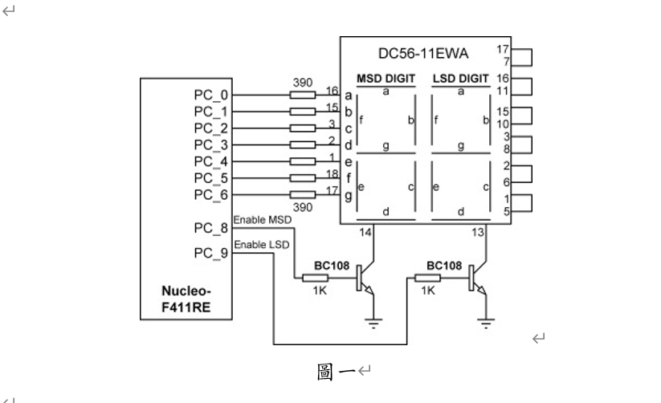
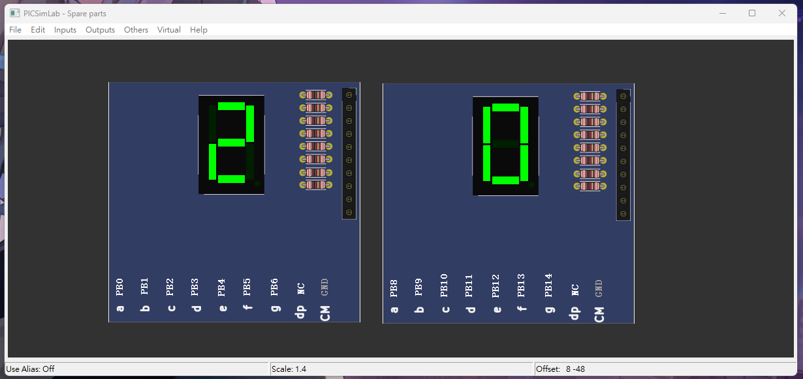

# (15 pts) 下列請以GPIOB完成，七段顯示器型號為DC56-11EWA：
## i. (5 pts) 將所有pin設定為output mode，並使pin 0~15輸出為0xAAAA。
```c
#include "stm32f10x.h"

int main()
{
	RCC->APB2ENR |= 0xFC; //啟用 GPIO 連接埠的 clock

	GPIOB->CRL = 0x33333333; //PB0 to PB7 outputs
	GPIOB->CRH = 0x33333333; //PB8 to PB15 outputs

	while (1) {
		GPIOB->ODR = 0xAAAA;
	}
}


```


## ii. (5 pts) 根據圖一完成表一：(Low為輸出低電位0，High為輸出高電位1)


|     |     |     |     |     |     |     |     |     |           |
| --- | --- | --- | --- | --- | --- | --- | --- | --- | --------- |
|     | x   | g   | f   | e   | d   | c   | b   | a   | PORTB_ODR |
| 0   | L   | L   | H   | H   | H   | H   | H   | H   | 0x3F      |
| 1   | L   | L   | L   | L   | L   | H   | H   | L   | 0x6       |
| 2   | L   | H   | L   | H   | H   | L   | H   | H   | 0x5B      |
| 3   | L   | H   | L   | L   | H   | H   | H   | H   | 0x4F      |
| 4   | L   | H   | H   | L   | L   | H   | H   | L   | 0x66      |
| 5   | L   | H   | H   | L   | H   | H   | L   | H   | 0x6D      |
| 6   | L   | H   | H   | H   | H   | H   | L   | H   | 0x7D      |
| 7   | L   | L   | H   | L   | L   | H   | H   | H   | 0x27      |
| 8   | L   | H   | H   | H   | H   | H   | H   | H   | 0x7F      |
| 9   | L   | H   | H   | L   | H   | H   | H   | H   | 0x6F      |

## iii. (5 pts) 編寫程式使七段顯示器顯示20。
```c
#include "stm32f10x.h"

int main()
{
	RCC->APB2ENR |= 0xFC; //啟用 GPIO 連接埠的 clock

	GPIOB->CRL = 0x33333333; //PB0 to PB7 outputs
	GPIOB->CRH = 0x33333333; //PB8 to PB15 outputs

	while (1) {
		GPIOB->ODR = 0x3F5B;
	}
}


```




## 數字 1 ~ 99 測試 code 
```c
#include "stm32f10x.h"
void delay_ms(uint16_t t);

int main()
{
	RCC->APB2ENR |= 0xFC; //啟用 GPIO 連接埠的 clock

	GPIOB->CRL = 0x33333333; //PB0 to PB7 outputs
	GPIOB->CRH = 0x33333333; //PB8 to PB15 outputs

	uint16_t arr[10] = {0x3F,0x6,0x5B,0x4F,0x66,0x6D,0x7D,0x27,0x7F,0x6F};

	while (1) {
		//GPIOB->ODR = 0x3F5B;
		for(int i = 0;i<100;i++){
			GPIOB->ODR = arr[i%10]<<8 | arr[i/10];
			delay_ms(10000);
		}
	}
}

void delay_ms(uint16_t t)
{
	volatile unsigned long l = 0;

	for(uint16_t i = 0; i < t; i++)
		for(l = 0; l < 9000; l++) ;
}

```