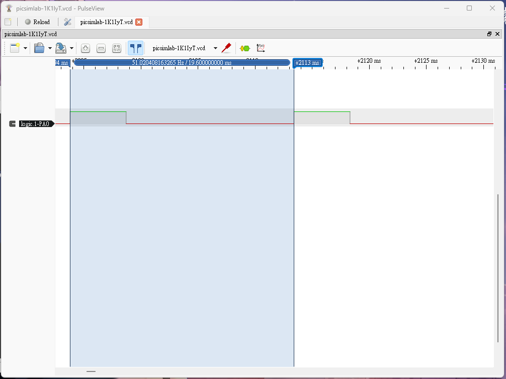

# (10 pts) 下列請以TIM2 (PWM)完成，伺服馬達型號為SG90：
## i. (5 pts) Generate a square wave with a period 20ms.


```c
#include "stm32f10x.h"

/*參考 Lab 16*/
int main()
{
	RCC->APB2ENR |= 0xFC; //啟用 GPIO 連接埠的 clock
	RCC->APB1ENR |= (1<<0);
	GPIOA->CRL |=0xB;
	TIM2->CCER = 0x1;
	TIM2->CCMR1 |=0x60;
	TIM2->PSC = 72 - 1;
	TIM2->ARR = 20000 - 1;
	TIM2->CCR1 = 5000;
	TIM2->CR1 = 1;

	while(1){

	}
}
```

## ii. (5 pts) 編寫程式使伺服馬達順時針與逆時針旋轉。
### 馬達控制補充
要讓伺服馬達 (例如 SG90) 旋轉，需要控制提供給它的 PWM 波形的**占空比 (Duty Cycle)**。SG90 伺服馬達的控制信號範圍：

- **週期：** 20ms
- **脈衝寬度 (高電平持續時間)：**
    - **1ms 脈衝：** 伺服馬達通常會轉到約 **0 度** (或逆時針極限)。
    - **1.5ms 脈衝：** 伺服馬達通常會轉到約 **90 度** (中心位置)。
    - **2ms 脈衝：** 伺服馬達通常會轉到約 **180 度** (或順時針極限)。

需要調整 PWM 的 `CCR1` (或 CCRx 寄存器) 的值，使其對應於 1ms、1.5ms、2ms 的脈衝寬度。


```c
#include "stm32f10x.h"

void delay_ms(uint16_t t);
/*參考 Lab 16*/
int main()
{
	RCC->APB2ENR |= 0xFC; //啟用 GPIO 連接埠的 clock
	RCC->APB1ENR |= (1<<0);
	GPIOA->CRL |=0xB;
	TIM2->CCER = 0x1;
	TIM2->CCMR1 |=0x60;
	TIM2->PSC = 72 - 1;
	TIM2->ARR = 20000 - 1;
	TIM2->CCR1 = 1500;//初始值設定為中間位置
	TIM2->CR1 = 1;

	while(1){
		//順時針轉至 180 度
		TIM2->CCR1 = 2000;
		delay_ms(10000);

		//逆時針轉至 0 度
		TIM2->CCR1 = 1000;
		delay_ms(10000);

//		//返回中心位置
//		TIM2->CCR1 = 1500;
//		delay_ms(10000);
	}
}

void delay_ms(uint16_t t)
{
	volatile unsigned long l = 0;

	for(uint16_t i = 0; i < t; i++)
		for(l = 0; l < 9000; l++) ;
}

```

