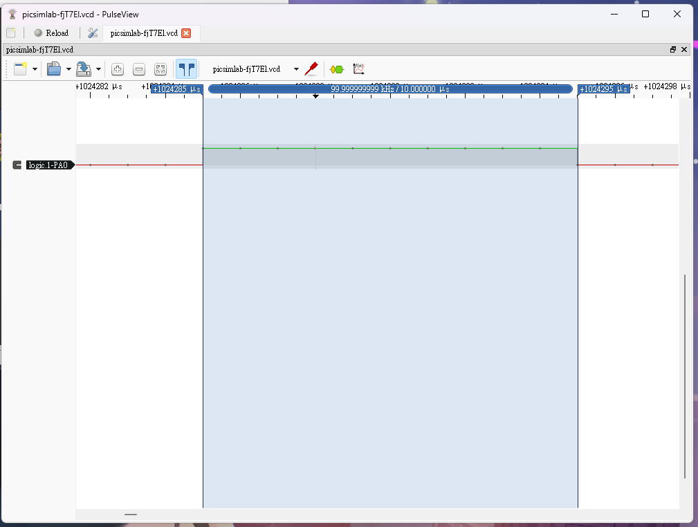
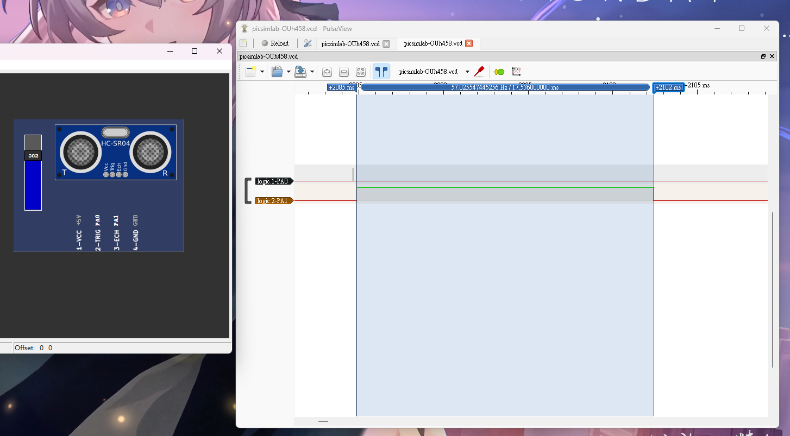

# (10 pts) 下列請以GPIOA完成，超音波模組型號為HC-SR04：
## i. (5 pts) Generate a pulse with a duration 10us via PA0 using a _for_ loop.


```c
#include "stm32f10x.h"
void delay_us(uint16_t t);
void delay_ms(uint16_t t);

int main()
{
	RCC->APB2ENR |= 0xFC; //啟用 GPIO 連接埠的 clock

	GPIOA->CRL = 0x33333333; //PA0 to PA7 outputs
	GPIOA->CRH = 0x33333333; //PA8 to PA15 outputs

	delay_ms(100); //緩衝100ms

	GPIOA->ODR = 1<<0; //PA0 on
	delay_us(10);
	GPIOA->ODR = 0<<0; //PA0 off
}

void delay_us(uint16_t t)
{
	volatile unsigned long l = 0;

	for(uint16_t i = 0; i < t; i++)
		for(l = 0; l < 7; l++) ;
}
void delay_ms(uint16_t t)
{
	volatile unsigned long l = 0;

	for(uint16_t i = 0; i < t; i++)
		for(l = 0; l < 9000; l++) ;
}

```

## ii. (5 pts) 編寫程式讀取超音波模組數據。


```c
#include "stm32f10x.h"
void delay_us(uint16_t t);
void delay_ms(uint16_t t);

int main()
{
	RCC->APB2ENR |= 0xFC; //啟用 GPIO 連接埠的 clock

	GPIOA->CRL = 0x33333343; //PA0 ,PA2 ~ PA7 outputs, PA1 input
	GPIOA->CRH = 0x33333333; //PA8 to PA15 outputs

	delay_ms(100); //緩衝100ms

	GPIOA->ODR = 1<<0; //PA0 on
	delay_us(10);
	GPIOA->ODR = 0<<0; //PA0 off
}

void delay_us(uint16_t t)
{
	volatile unsigned long l = 0;

	for(uint16_t i = 0; i < t; i++)
		for(l = 0; l < 7; l++) ;
}
void delay_ms(uint16_t t)
{
	volatile unsigned long l = 0;

	for(uint16_t i = 0; i < t; i++)
		for(l = 0; l < 9000; l++) ;
}

```


## 補充
**HC-SR04 超音波模組工作原理簡述：**

HC-SR04 有四個引腳：Vcc, Trig, Echo, GND。

- **Vcc 和 GND：** 接 5V 電源。
- **Trig (觸發腳)：** 輸出一個 10us 以上的高電平脈衝來觸發測距。
- **Echo (回響腳)：** 當超音波發射出去後，此引腳會變為高電平，直到接收到回響為止。高電平持續的時間就是超音波從發射到接收所需的時間。

**測距公式：**

距離 = (高電平持續時間 * 聲速) / 2 其中聲速在常溫下約為 340m/s 或 0.034cm/us。 所以，距離 (cm) = (高電平持續時間 (us) * 0.034) / 2 或更簡化：距離 (cm) = 高電平持續時間 (us) / 58

