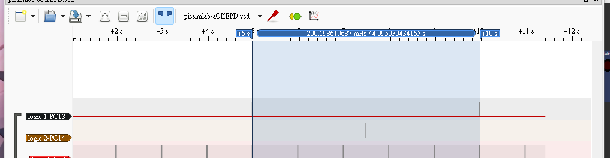
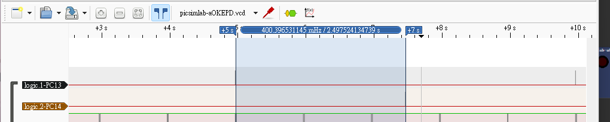
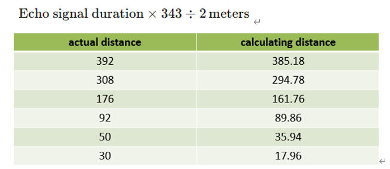

# (55 pts) 下列請以Interrupt與Timer完成系統整合實現停車場系統 (有關時間的都要用Timer 或 SysTick 實現)：

## i. 超音波感測 (建議使用 Timer2)
### A. (5 pts) 入口每5秒產生一個trig檢測是否有車子要進來。

### B. (5 pts) 出口先延遲2.5秒再每5秒產生一個trig是否有車子要出去。





### C. (15 pts) 使用中斷捕捉 Echo 上升時間和下降時間，然後透過下面公式轉換成公尺。(建議使用 SysTick 中斷，出來的結果與實際有誤差是正常現象)


## ii. 伺服馬達閘門 (建議使用 Timer1 和 Timer2)
### A. (10 pts) 當出入口的Echo 讀到的值小於 100m，相對應的閘門要打開讓車子進出，然後關閉閘門(伺服馬達打開和關閉閘門90度轉動)。

### B. (10 pts) 車輛進入時剩餘車位減1，車輛出去時剩餘車位加1，並將剩餘車位數顯示於2-digit七段顯示器(車位數初始值20)。

### C. (5 pts) 當車位停滿時，七段顯示器顯示00並以一秒為週期進行閃爍(連續重複亮0.5 sec與暗0.5 sec)。此時，閘門維持不動。

### D. (5 pts) 透過藍芽(USART1)傳送目前車輛數目給 IO Virtual Term (轉成兩個數字的ASCII Code後傳送)。

```c
#include "stm32f10x.h"
#include <stdio.h>
#include <string.h>

// --- 全域變數 ---
volatile uint32_t entry_echo_duration_us = 0;
volatile uint32_t exit_echo_duration_us = 0;
volatile uint8_t entry_detected_flag = 0;
volatile uint8_t exit_detected_flag = 0;
volatile int remaining_spaces = 20;
volatile uint32_t usTicks = 0; // 唯一的微秒計時器
volatile uint32_t trig_gap = 5 * 1000000;
volatile uint32_t servo_delay = 500;

// --- 輔助函式 ---
void delay_us(uint32_t us) {
    uint32_t start = usTicks;
    while ((usTicks - start) < us);
}

void delay_ms(uint32_t ms) {
    for (uint32_t i = 0; i < ms; i++) {
        delay_us(1000);
    }
}

// --- 中斷服務常式 (ISRs) ---

// SysTick 中斷: 只負責累加 usTicks
void SysTick_Handler(void) {
    usTicks++;
}

// EXTI 中斷: 邏輯不變，基於 usTicks 計時
static volatile uint32_t entry_echo_start_us = 0;
static volatile uint32_t exit_echo_start_us = 0;

void EXTI1_IRQHandler(void) { // 出口 Echo (PA1)
    if ((EXTI->PR & (1 << 1)) != 0) {
        if ((GPIOA->IDR & (1 << 1)) != 0) {
            exit_echo_start_us = usTicks;
        } else {
            exit_echo_duration_us = usTicks - exit_echo_start_us;
            exit_detected_flag = 1;
        }
        EXTI->PR = (1 << 1);
    }
}

void EXTI2_IRQHandler(void) { // 入口 Echo (PA2)
    if ((EXTI->PR & (1 << 2)) != 0) {
        if ((GPIOA->IDR & (1 << 2)) != 0) {
            entry_echo_start_us = usTicks;
        } else {
            entry_echo_duration_us = usTicks - entry_echo_start_us;
            entry_detected_flag = 1;
        }
        EXTI->PR = (1 << 2);
    }
}


void usart1_sendByte(char c) {
    while ((USART1->SR & (1 << 7)) == 0);
    USART1->DR = c;
    while ((USART1->SR & (1 << 6)) == 0);
}

void usart1_sendStr(char *str) {
    while (*str) { usart1_sendByte(*str++); }
}

void update_display(int count) {
    uint16_t arr[10] = {0x3F, 0x06, 0x5B, 0x4F, 0x66, 0x6D, 0x7D, 0x27, 0x7F, 0x6F};
    if (count >= 0 && count <= 99) {
        GPIOB->ODR = (arr[count / 10] << 8) | arr[count % 10];
    }
}

// --- 主函式 ---
int main(void) {
    // 使用您驗證過的 27MHz 系統時脈相關設定
    uint32_t sys_clock_freq = 27000000;
    uint32_t tim1_clock_freq = 144000000;
    uint32_t tim2_clock_freq = 72000000;
    uint32_t usart1_clock_freq = 72000000; // 假設與 TIM2 同源

    // --- 時脈初始化 ---
    RCC->APB2ENR |= (1 << 0) | (1 << 2) | (1 << 3) | (1 << 4) | (1 << 11) | (1 << 14);
    RCC->APB1ENR |= (1 << 0) | (1 << 1);

    // --- GPIO 初始化 ---
    GPIOB->CRL = 0x33333333; GPIOB->CRH = 0x33333333;
    GPIOC->CRH = (GPIOC->CRH & ~0x0FF00000) | 0x03300000;
    // 合併設定 PA0, PA1, PA2
    GPIOA->CRL = (GPIOA->CRL & ~0x00000FFF) | (0x8 << 8) | (0x8 << 4) | (0xB << 0);
    GPIOA->ODR |= (1 << 1) | (1 << 2);
    // 合併設定 PA8, PA9, PA10
    GPIOA->CRH = (GPIOA->CRH & ~0x00000FFF) | (0x4 << 8) | (0xB << 4) | (0xB << 0);

    // --- SysTick 初始化 (1µs tick) ---
    SysTick->LOAD = (sys_clock_freq / 1000000) - 1; // 27 - 1
    SysTick->VAL = 0;
    SysTick->CTRL = 3;

    // --- TIM1 & TIM2 PWM 初始化 (不再需要中斷) ---
    TIM1->PSC = (tim1_clock_freq / 1000000) - 1; // 144 - 1
    TIM1->ARR = 20000 - 1;
    TIM1->CCR1 = 1500;
    TIM1->CCMR1 = 0x68; TIM1->CCER = 0x01; TIM1->BDTR = 0x8000;
    TIM1->CR1 = 0x81;

    TIM2->PSC = (tim2_clock_freq / 1000000) - 1; // 72 - 1
    TIM2->ARR = 20000 - 1;
    TIM2->CCR1 = 1500;
    TIM2->CCMR1 = 0x68; TIM2->CCER = 0x01;
    TIM2->CR1 = 0x81;

    // --- USART1 初始化 ---
    USART1->BRR = usart1_clock_freq / 9600; // 7500
    USART1->CR1 = 0x200C;

    // --- EXTI & NVIC 初始化 ---
    AFIO->EXTICR[0] = (AFIO->EXTICR[0] & ~0x0FF0) | (0x0 << 8) | (0x0 << 4);
    EXTI->IMR |= (1 << 1) | (1 << 2);
    EXTI->RTSR |= (1 << 1) | (1 << 2);
    EXTI->FTSR |= (1 << 1) | (1 << 2);
    NVIC->ISER[0] |= (1 << 7) | (1 << 8); // 只啟用 EXTI1, EXTI2 中斷

    // --- 主迴圈 ---
    uint32_t last_bt_send_time_us = 0;
    uint32_t last_entry_trig_time_us = 0;
    uint32_t last_exit_trig_time_us = 0;
    int exit_trig_started = 0; // 用於標記出口觸發是否已開始

    update_display(remaining_spaces);

    while(1) {
        float distance_m; char buffer[30];

        // --- 主迴圈中的週期性 Trig ---
        if (usTicks - last_entry_trig_time_us >= trig_gap) { // 5秒
            last_entry_trig_time_us = usTicks;
            GPIOC->BSRR = (1 << 13);
            delay_us(10);
            GPIOC->BRR = (1 << 13);
        }

        // 延遲 2.5 秒後才開始出口的 Trig
        if (!exit_trig_started && usTicks >= trig_gap / 2) {
            exit_trig_started = 1;
            last_exit_trig_time_us = usTicks;
        }

        if (exit_trig_started && (usTicks - last_exit_trig_time_us >= trig_gap)) { // 5秒
            last_exit_trig_time_us = usTicks;
            GPIOC->BSRR = (1 << 14);
            delay_us(10);
            GPIOC->BRR = (1 << 14);
        }

        // --- 處理感測器旗標 ---
        if (entry_detected_flag) {
            entry_detected_flag = 0;
            distance_m = (entry_echo_duration_us * 343.0 / 2.0) / 1000000.0;
            if (distance_m < 1.0 && remaining_spaces > 0) {
                remaining_spaces--;
                TIM1->CCR1 = 500; delay_ms(servo_delay); TIM1->CCR1 = 1500;
            }
        }

        if (exit_detected_flag) {
            exit_detected_flag = 0;
            distance_m = (exit_echo_duration_us * 343.0 / 2.0) / 1000000.0;
            if (distance_m < 1.0 && remaining_spaces < 20) {
                remaining_spaces++;
                TIM2->CCR1 = 2500; delay_ms(servo_delay); TIM2->CCR1 = 1500;
            }
        }

        // --- 處理顯示與通訊 ---
        if (remaining_spaces == 0) {
            if ((usTicks / 500000) % 2) { GPIOB->ODR = 0x0000; }
            else { update_display(0); }
        } else {
            update_display(remaining_spaces);
        }

        if (usTicks - last_bt_send_time_us >= 1000000) {
            last_bt_send_time_us = usTicks;
            sprintf(buffer, "SPACES: %02d\r\n", remaining_spaces);
            usart1_sendStr(buffer);
        }
    }
}

```


## 調適完至少能運行的 code
```c
#include "stm32f10x.h"
#include <stdio.h>
#include <string.h>

// --- 全域變數 ---
volatile uint32_t entry_echo_duration_us = 0;
volatile uint32_t exit_echo_duration_us = 0;
volatile uint8_t entry_detected_flag = 0;
volatile uint8_t exit_detected_flag = 0;
volatile int remaining_spaces = 20;
volatile uint32_t usTicks = 0; // 唯一的微秒計時器
volatile uint32_t trig_gap = 5 * 1000000;
volatile uint32_t servo_delay = 0;
volatile char text[] = "test\r\n";

// --- 新增：USART 發送緩衝區 ---
#define TX_BUFFER_SIZE 128
char tx_buffer[TX_BUFFER_SIZE];
volatile uint16_t tx_head = 0;
volatile uint16_t tx_tail = 0;

// --- 輔助函式 ---
void delay_us(uint32_t us) {
    uint32_t start = usTicks;
    while ((usTicks - start) < us);
}

void delay_ms(uint32_t ms) {
    for (uint32_t i = 0; i < ms; i++) {
        delay_us(1000);
    }
}

// --- 中斷服務常式 (ISRs) ---

// SysTick 中斷: 只負責累加 usTicks
void SysTick_Handler(void) {
    usTicks++;
}

// EXTI 中斷: 邏輯不變，基於 usTicks 計時
static volatile uint32_t entry_echo_start_us = 0;
static volatile uint32_t exit_echo_start_us = 0;

void EXTI1_IRQHandler(void) { // 出口 Echo (PA1)
	usart1_sendStr(text);
    if ((EXTI->PR & (1 << 1)) != 0) {
        if ((GPIOA->IDR & (1 << 1)) != 0) {
            exit_echo_start_us = usTicks;
        } else {
            exit_echo_duration_us = usTicks - exit_echo_start_us;
            exit_detected_flag = 1;
            usart1_sendStr(text);
        }
        EXTI->PR = (1 << 1);
    }
}

void EXTI2_IRQHandler(void) { // 入口 Echo (PA2)
    if ((EXTI->PR & (1 << 2)) != 0) {
        if ((GPIOA->IDR & (1 << 2)) != 0) {
            entry_echo_start_us = usTicks;
        } else {
            entry_echo_duration_us = usTicks - entry_echo_start_us;
            entry_detected_flag = 1;
        }
        EXTI->PR = (1 << 2);
    }
}

// --- 新增：USART1 中斷服務常式 ---
void USART1_IRQHandler(void) {
    // 檢查是否為 TXE (發送緩存區空) 中斷
    if ((USART1->SR & (1 << 7)) != 0) {
        if (tx_head != tx_tail) {
            // 如果緩衝區還有資料，發送下一個字元
            USART1->DR = tx_buffer[tx_tail];
            tx_tail = (tx_tail + 1) % TX_BUFFER_SIZE;
        } else {
            // 如果緩衝區已空，關閉 TXE 中斷
            USART1->CR1 &= ~(1 << 7); // 清除 TXEIE 位
        }
    }
}

//void usart1_sendByte(char c) {
//    //while ((USART1->SR & (1 << 7)) == 0);
//    USART1->DR = c;
//    while ((USART1->SR & (1 << 6)) == 0);
//}
//
//void usart1_sendStr(char *str) {
//    while (*str) { usart1_sendByte(*str++); }
//}

// --- 修改：非阻塞的 usart1_sendStr ---
void usart1_sendStr(char *str) {
    while (*str) {
        // 將字元放入緩衝區
        tx_buffer[tx_head] = *str++;
        tx_head = (tx_head + 1) % TX_BUFFER_SIZE;
    }
    // 啟用 TXE 中斷，開始發送過程
    USART1->CR1 |= (1 << 7); // 設定 TXEIE 位
}

void update_display(int count) {
    uint16_t arr[10] = {0x3F, 0x06, 0x5B, 0x4F, 0x66, 0x6D, 0x7D, 0x27, 0x7F, 0x6F};
    if (count >= 0 && count <= 99) {
        GPIOB->ODR = (arr[count / 10] << 8) | arr[count % 10];
    }
}

// --- 主函式 ---
int main(void) {
    // 使用您驗證過的 27MHz 系統時脈相關設定
    uint32_t sys_clock_freq = 27000000;
    uint32_t tim1_clock_freq = 144000000;
    uint32_t tim2_clock_freq = 72000000;
    uint32_t usart1_clock_freq = 72000000; // 假設與 TIM2 同源

    // --- 時脈初始化 ---
    RCC->APB2ENR |= (1 << 0) | (1 << 2) | (1 << 3) | (1 << 4) | (1 << 11) | (1 << 14);
    RCC->APB1ENR |= (1 << 0) | (1 << 1);

    // --- GPIO 初始化 ---
    GPIOB->CRL = 0x33333333; GPIOB->CRH = 0x33333333;
    GPIOC->CRH = (GPIOC->CRH & ~0x0FF00000) | 0x03300000;
    // 合併設定 PA0, PA1, PA2
    GPIOA->CRL = (GPIOA->CRL & ~0x00000FFF) | (0x8 << 8) | (0x8 << 4) | (0xB << 0);
    GPIOA->ODR |= (1 << 1) | (1 << 2);
    // 合併設定 PA8, PA9, PA10
    GPIOA->CRH = (GPIOA->CRH & ~0x00000FFF) | (0x4 << 8) | (0xB << 4) | (0xB << 0);

    // --- SysTick 初始化 (1µs tick) ---
    SysTick->LOAD = (sys_clock_freq / 1000000) - 1; // 27 - 1
    SysTick->VAL = 0;
    SysTick->CTRL = 3;

    // --- TIM1 & TIM2 PWM 初始化 (不再需要中斷) ---
    TIM1->PSC = (tim1_clock_freq / 1000000) - 1; // 144 - 1
    TIM1->ARR = 20000 - 1;
    TIM1->CCR1 = 1500;
    TIM1->CCMR1 = 0x68; TIM1->CCER = 0x01; TIM1->BDTR = 0x8000;
    TIM1->CR1 = 0x81;

    TIM2->PSC = (tim2_clock_freq / 1000000) - 1; // 72 - 1
    TIM2->ARR = 20000 - 1;
    TIM2->CCR1 = 1500;
    TIM2->CCMR1 = 0x68; TIM2->CCER = 0x01;
    TIM2->CR1 = 0x81;

    // --- USART1 初始化 ---
    USART1->BRR = usart1_clock_freq / 9600; // 7500
    //USART1->CR1 = 0x200C;
    USART1->CR1 = 0x202C; // UE, TE, RE, RXNEIE (接收中斷，即使不用也建議開啟)

    // --- EXTI & NVIC 初始化 ---
    AFIO->EXTICR[0] = (AFIO->EXTICR[0] & ~0x0FF0) | (0x0 << 8) | (0x0 << 4);
    EXTI->IMR |= (1 << 1) | (1 << 2);
    EXTI->RTSR |= (1 << 1) | (1 << 2);
    EXTI->FTSR |= (1 << 1) | (1 << 2);
    NVIC->ISER[0] |= (1 << 7) | (1 << 8); // 只啟用 EXTI1, EXTI2 中斷
    NVIC->ISER[1] |= (1 << (USART1_IRQn - 32)); // 啟用 USART1 中斷 (IRQ 37)

    // --- 主迴圈 ---
    uint32_t last_bt_send_time_us = 0;
    uint32_t last_entry_trig_time_us = 0;
    uint32_t last_exit_trig_time_us = 0;
    int exit_trig_started = 0; // 用於標記出口觸發是否已開始

    update_display(remaining_spaces);

    while(1) {
        float distance_m; char buffer[30];

        // --- 主迴圈中的週期性 Trig ---
        if (usTicks - last_entry_trig_time_us >= trig_gap) { // 5秒
            last_entry_trig_time_us = usTicks;
            GPIOC->BSRR = (1 << 13);
            delay_us(10);
            GPIOC->BRR = (1 << 13);
        }

        // 延遲 2.5 秒後才開始出口的 Trig
        if (!exit_trig_started && usTicks >= trig_gap / 2) {
            exit_trig_started = 1;
            last_exit_trig_time_us = usTicks;
        }

        if (exit_trig_started && (usTicks - last_exit_trig_time_us >= trig_gap)) { // 5秒
            last_exit_trig_time_us = usTicks;
            GPIOC->BSRR = (1 << 14);
            delay_us(10);
            GPIOC->BRR = (1 << 14);
        }

        // --- 處理感測器旗標 ---
        if (entry_detected_flag) {
            entry_detected_flag = 0;

            char debug_buffer[50];

            // 1. 印出原始的 Echo 持續時間 (us)
            sprintf(debug_buffer, "entry Duration (us): %lu\r\n", entry_echo_duration_us);
            usart1_sendStr(debug_buffer);

            distance_m = (entry_echo_duration_us * 343.0 / 2.0) / 1000000.0;
            if (distance_m < 1.0 && remaining_spaces > 0) {
                remaining_spaces--;
                TIM1->CCR1 = 500; delay_ms(servo_delay); TIM1->CCR1 = 1500;
            }
        }

        if (exit_detected_flag) {
            exit_detected_flag = 0;
            usart1_sendStr(text);
            // --- 新增的除錯程式碼 ---
            char debug_buffer[50];

            // 1. 印出原始的 Echo 持續時間 (us)
            sprintf(debug_buffer, "Exit Duration (us): %lu\r\n", exit_echo_duration_us);
            usart1_sendStr(debug_buffer);

            distance_m = (exit_echo_duration_us * 343.0 / 2.0) / 1000000.0;

            if (distance_m < 1.0 && remaining_spaces < 20) {
            	usart1_sendStr(text);
                remaining_spaces++;
                TIM2->CCR1 = 2500; delay_ms(servo_delay); TIM2->CCR1 = 1500;
            }
        }

        // --- 處理顯示與通訊 ---
        if (remaining_spaces == 0) {
            if ((usTicks / 500000) % 2) { GPIOB->ODR = 0x0000; }
            else { update_display(0); }
        } else {
            update_display(remaining_spaces);
        }

        if (usTicks - last_bt_send_time_us >= 500000) {
            last_bt_send_time_us = usTicks;
            sprintf(buffer, "SPACES: %02d\r\n", remaining_spaces);
            usart1_sendStr(buffer);
        }
    }
}

```
