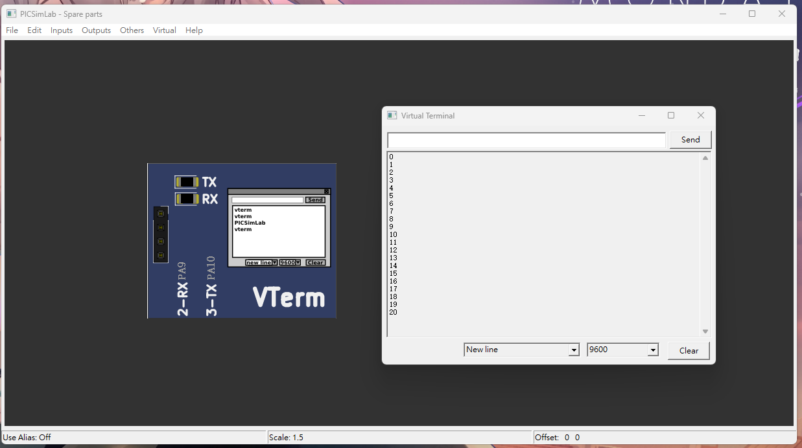

# (10 pts) 下列請以USART1 (baud rate為9600)完成，藍芽模組型號為HC-06：
## i. (5 pts) Send a character (‘A’) to the IO Virtual Term.


```C
#include "stm32f10x.h"

void delay_ms(uint16_t t);
void usart1_sendByte(unsigned char c);
/*參考 Lab 13*/
int main()
{
	RCC->APB2ENR |= (1<<14) | (1<<2);
	GPIOA->CRH |=0x000000B0;
	USART1->CR1 = 0x200C;
	USART1->BRR = 7500;

	usart1_sendByte('A');
}
void delay_ms(uint16_t t)
{
	volatile unsigned long l = 0;

	for(uint16_t i = 0; i < t; i++)
		for(l = 0; l < 9000; l++) ;
}

void usart1_sendByte(unsigned char c){
	USART1->DR = c;
	while((USART1->SR & (1<<6)) == 0);
}

```

## ii.(5 pts) 編寫程式使藍芽(USART1)每秒發送一個數字給IO Virtual Term，數字依序為0至20。


```c
#include "stm32f10x.h"
#include <string.h>

void delay_ms(uint16_t t);
void usart1_sendByte(unsigned char c);
void usart1_sendStr(char *str); //字串輸出
/*參考 Lab 13*/
int main()
{
	RCC->APB2ENR |= (1<<14) | (1<<2);
	GPIOA->CRH |=0x000000B0;
	USART1->CR1 = 0x200C;
	USART1->BRR = 7500;

	char tx_buffer[10]; // 緩衝區，用於存儲數字的字串表示

	for(int i = 0;i<=20;i++){
		// 將當前數字轉換為字串
		sprintf(tx_buffer, "%d\r\n", i);
		usart1_sendStr(tx_buffer);
		delay_ms(1000);
	}
}
void delay_ms(uint16_t t)
{
	volatile unsigned long l = 0;

	for(uint16_t i = 0; i < t; i++)
		for(l = 0; l < 9000; l++) ;
}

void usart1_sendByte(unsigned char c){
	USART1->DR = c;
	while((USART1->SR & (1<<6)) == 0);
}

void usart1_sendStr(char *str) {
	int counter = 0;
	while(str[counter] != '\0'){
			usart1_sendByte(str[counter]);
			counter++;
		}
	}

```


